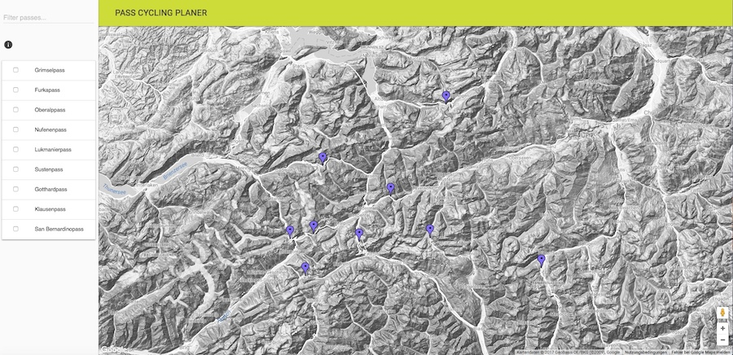
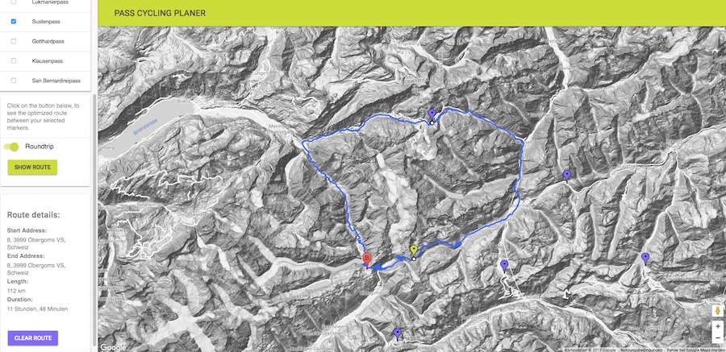

# PASS CYCLING PLANER

Plan your cycling route over various swiss mountain passes. 🚵

## Getting Started

You can get a local copy of the project by running this command on your console:
```
git clone git@github.com:hkfrei/PassCyclingPlaner.git
```
After that, you should have a new directory named "PassCyclingPlaner". Enter it by typing...
`cd PassCyclingPlaner`.


### Prerequisites

The project needs the package manager [Yarn](https://yarnpkg.com/). You can install it from [here](https://yarnpkg.com/en/docs/install)


### Installing

While in the newly created folder, install all the dependencies.
```zsh
yarn install
```

After that, you can start a development server by enter the following command...
```zsh
yarn run blendid
```

This is where the magic happens. The perfect front-end workflow. This runs the development task, which starts compiling, watching, and live updating all our files as we change them. Browsersync will start a server on port 3000, or do whatever you've configured it to do. You'll be able to see live changes in all connected browsers. Don't forget about the additional Browsersync UI tools available on port 3001!

### Plan a route
On the left of the page, you can see all the available mountain passes. If you switch two or more toggles to on, a dialog appears to calculate the cycling route...


To calculate a route, click the "SHOW ROUTE" button...


If you want to get some more information about a pass, klick on a marker...


## Running the tests

### end to end tests

Currently there are no end to end tests defined.

### coding style tests

This project uses eslint to test coding style. You can see the current configuration in *.eslintrc.js*.
What's special about the current config, is that the UDACITY style checker is installed. Currently *app.js* and all the files
in the *modules* folder are beeing linted.
You can run tests with...

```
yarn run lint
```
Don't forget, you need to be in the *root* directory to run this command successfully.

## Deployment

```zsh
yarn run blendid -- build
```

Compiles files for production to your destination directory. JS files are built with webpack 3 with standard production optimizations (uglfiy, etc.). CSS is run through CSSNano. If `rev` is set to `true` in your `task-config.js` file, filenames will be hashed (file.css -> file-a8908d9io20.css) so your server may cache them indefinitely. A `rev-manifest.json` file is output to the root of your `dest` directory (`public` by default), and maps original filenames to hashed ones. Helpers exist for Rails and Craft that read this file and automatically update filenames in your apps. CSS and HTML files read this file and string-replace filenames automatically.
After that, you can copy the contents of the public folder to your webserver of choice.

## Built With

* [BLENDID](https://github.com/vigetlabs/blendid/blob/master/README.md) - The awesome build tools
* [YARN](https://yarnpkg.com/) - Package Management
* [Google Maps API](https://developers.google.com/maps/documentation/javascript/) - Mapping library and directions Service
* [Wikipedia](https://de.wikipedia.org/) The Wikipedia API.
* [Material Design Lite](https://getmdl.io/index.html) layout elements (css and javascript).

## Contributing

Of course, this project can be extended. One cool thing, would be a elevation profile for the routes.
Please read [CONTRIBUTING.md](https://gist.github.com/PurpleBooth/b24679402957c63ec426) for details on our code of conduct, and the process for submitting pull requests to us.

## Versioning

We use [SemVer](http://semver.org/) for versioning. For the versions available, see the [tags on this repository](https://github.com/hkfrei/alpinePassMap/tags). 

## Authors

* **Hanskaspar Frei**

See also the list of [contributors](https://github.com/hkfrei/alpinePassMap/contributors) who participated in this project.

## License

This project is licensed under the MIT License - see the [LICENSE](LICENSE) file for details

## Acknowledgments
* [UDACITY](https://www.udacity.com) for the code examples on how to work with the Google directions service.
* The awesome [BLENDID](https://github.com/vigetlabs/blendid/blob/master/README.md) task and build tools. With that, I finally found a good way to organize my code in modules.
* Vince Garcia, my cycling buddy who drove many of those passes with me;-)